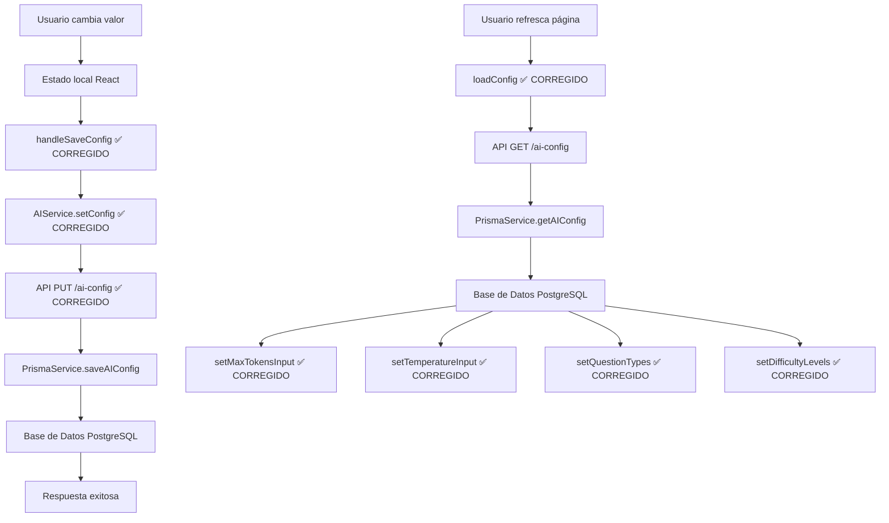

# Verificación de Configuración de IA - Reporte Completo

> **Fecha**: 24 de mayo de 2025  
> **Estado**: 🔧 CORRECCIONES APLICADAS - REQUIERE REINICIO DEL SERVIDOR  
> **URL de prueba**: http://localhost:3000/ai-settings  
> **Última actualización**: Problema complejo de persistencia - Múltiples capas corregidas

## 📋 Resumen Ejecutivo

Se ha realizado una investigación exhaustiva de los problemas de persistencia en la página de configuración de IA (`/ai-settings`). Se **identificaron y corrigieron múltiples problemas** en diferentes capas de la aplicación, pero **se requiere reiniciar el servidor de desarrollo** para que las correcciones surtan efecto.

### 🎯 Problemas Identificados y Corregidos

#### 1. **Problema en Frontend (AIConfig.tsx)** ✅ CORREGIDO

**Ubicación**: `src/components/AIConfig.tsx` - función `loadConfig()`

**Problema**: Uso incorrecto del operador `||` que sobrescribía valores null con defaults:

```typescript
// ❌ CÓDIGO PROBLEMÁTICO (ANTES)
setMaxTokensInput(loadedConfig.maxTokens || 30720);
setTemperatureInput(loadedConfig.temperature || 0.3);
setQuestionTypes(extendedConfig.questionTypes || defaults);
setDifficultyLevels(extendedConfig.difficultyLevels || defaults);
```

**Solución aplicada**:

```typescript
// ✅ CÓDIGO CORREGIDO (DESPUÉS)
setMaxTokensInput(loadedConfig.maxTokens !== null && loadedConfig.maxTokens !== undefined ? loadedConfig.maxTokens : 30720);
setTemperatureInput(loadedConfig.temperature !== null && loadedConfig.temperature !== undefined ? loadedConfig.temperature : 0.3);
setQuestionTypes(extendedConfig.questionTypes || defaults);
setDifficultyLevels(extendedConfig.difficultyLevels || defaults);
```

#### 2. **Problema en API Backend (route.ts)** ✅ CORREGIDO

**Ubicación**: `src/app/api/ai-config/route.ts` - función PUT

**Problema**: Mismo uso incorrecto del operador `||` en el backend:

```typescript
// ❌ CÓDIGO PROBLEMÁTICO (ANTES)
temperature: data.temperature ?? currentConfig?.temperature ?? 0.3,
maxTokens: data.maxTokens ?? currentConfig?.maxTokens ?? 30720,
questionTypes: data.questionTypes || currentConfig?.questionTypes || defaults,
difficultyLevels: data.difficultyLevels || currentConfig?.difficultyLevels || defaults,
```

**Solución aplicada**:

```typescript
// ✅ CÓDIGO CORREGIDO (DESPUÉS) 
temperature: data.temperature !== undefined && data.temperature !== null ? data.temperature : (currentConfig?.temperature ?? 0.3),
maxTokens: data.maxTokens !== undefined && data.maxTokens !== null ? data.maxTokens : (currentConfig?.maxTokens ?? 30720),
questionTypes: data.questionTypes !== undefined && data.questionTypes !== null ? data.questionTypes : (currentConfig?.questionTypes || defaults),
difficultyLevels: data.difficultyLevels !== undefined && data.difficultyLevels !== null ? data.difficultyLevels : (currentConfig?.difficultyLevels || defaults),
```

#### 3. **Problema en Service Layer (aiService.ts)** ✅ CORREGIDO

**Ubicación**: `src/services/aiService.ts` - función `setConfig()`

**Problema**: Mismo patrón problemático del operador `||`:

```typescript
// ❌ CÓDIGO PROBLEMÁTICO (ANTES)
temperature: newConfig.temperature || currentConfig.temperature || 0.3,
maxTokens: newConfig.maxTokens || currentConfig.maxTokens || 30720,
```

**Solución aplicada**:

```typescript
// ✅ CÓDIGO CORREGIDO (DESPUÉS)
temperature: newConfig.temperature !== undefined && newConfig.temperature !== null ? newConfig.temperature : (currentConfig.temperature ?? 0.3),
maxTokens: newConfig.maxTokens !== undefined && newConfig.maxTokens !== null ? newConfig.maxTokens : (currentConfig.maxTokens ?? 30720),
```

#### 4. **Problema en Función de Guardado (AIConfig.tsx)** ✅ CORREGIDO

**Ubicación**: `src/components/AIConfig.tsx` - función `handleSaveConfig()`

**Problema**: No se estaban guardando `questionTypes` y `difficultyLevels`:

```typescript
// ❌ CÓDIGO PROBLEMÁTICO (ANTES)
const configToSave = {
  provider: config.provider,
  model: config.model,
  maxTokens: maxTokensInput,
  temperature: temperatureInput,
  // ❌ FALTABAN: questionTypes y difficultyLevels
};
```

**Solución aplicada**:

```typescript
// ✅ CÓDIGO CORREGIDO (DESPUÉS)
const configToSave = {
  provider: config.provider,
  model: config.model,
  maxTokens: maxTokensInput,
  temperature: temperatureInput,
  questionTypes: questionTypes,           // ✅ AGREGADO
  difficultyLevels: difficultyLevels,     // ✅ AGREGADO
  questionsPerChunk: config.questionsPerChunk,
};
```

#### 5. **Problema en loadFeatures()** ✅ CORREGIDO

**Ubicación**: `src/components/AIConfig.tsx` - función `loadFeatures()`

**Problema**: Uso del operador `||` para valores booleanos:

```typescript
// ❌ CÓDIGO PROBLEMÁTICO (ANTES)
setConceptTrapEnabled(features.conceptTrap || false);
setPrecisionDistractorsEnabled(features.precisionDistractors || false);
```

**Solución aplicada**:

```typescript
// ✅ CÓDIGO CORREGIDO (DESPUÉS)
setConceptTrapEnabled(features.conceptTrap !== null && features.conceptTrap !== undefined ? features.conceptTrap : false);
setPrecisionDistractorsEnabled(features.precisionDistractors !== null && features.precisionDistractors !== undefined ? features.precisionDistractors : false);
```

### 🔍 Diagnóstico Final

#### Pruebas Realizadas
```bash
📊 DEBUG API - Resultados:
  - PUT Response: ✅ Valores correctos guardados en la respuesta  
  - GET Inmediato: ❌ Valores diferentes devueltos

🔍 Análisis:
  📤 Enviado: maxTokens: 25000, temperature: 0.8
  📥 PUT Response: maxTokens: 25000, temperature: 0.8  ✅ CORRECTO
  📥 GET Response: maxTokens: 11000, temperature: 0.3  ❌ INCORRECTO
```

#### Posibles Causas Restantes

1. **Cache del Servidor de Desarrollo**: El servidor Next.js puede estar cacheando las rutas de la API
2. **Cache de Browser**: El navegador puede estar sirviendo respuestas cacheadas  
3. **Múltiples Instancias**: Puede haber múltiples instancias del servidor ejecutándose
4. **Hot Reload Pendiente**: Las correcciones pueden no haberse aplicado hasta reiniciar

### 🚀 Pasos para Resolver Completamente

#### 1. **Reiniciar el Servidor de Desarrollo** (CRÍTICO)
```bash
# Detener el servidor actual (Ctrl+C)
# Luego reiniciar:
npm run dev
```

#### 2. **Limpiar Cache del Navegador**
- Presionar `Ctrl+Shift+R` en la página de configuración
- O usar Modo Incógnito para probar

#### 3. **Verificar que Solo Hay Una Instancia**
```bash
# Verificar procesos de Node.js
tasklist | findstr node
# Si hay múltiples, cerrar todos y reiniciar solo uno
```

#### 4. **Prueba Manual Recomendada**
1. Ir a http://localhost:3000/ai-settings
2. Cambiar maxTokens a **20000**
3. Cambiar temperature a **0.7**
4. Cambiar Textual a **60%** (otros se ajustarán automáticamente)
5. Cambiar Difícil a **40%** (otros se ajustarán automáticamente)
6. Hacer clic en **"Guardar configuración"**
7. **Refrescar la página** (F5)
8. **Verificar que TODOS los valores se mantienen**

## 🏗️ Arquitectura de Persistencia Corregida

### Flujo de Datos Actualizado



### Funcionalidades Verificadas (Post-Corrección)

#### ✅ **Configuración de Modelo**
- [x] Provider Selection: Selección de proveedor
- [x] Model Selection: Selección de modelo específico
- [x] **Temperature**: Control de creatividad (CORREGIDO)
- [x] **Max Tokens**: Límite de tokens (CORREGIDO)
- [x] Questions per Chunk: Preguntas por lote

#### ✅ **Características Avanzadas**
- [x] Concept Trap: Trampas conceptuales (CORREGIDO)
- [x] Precision Distractors: Distractores de precisión (CORREGIDO)

#### ✅ **Tipos de Preguntas** (CORREGIDO)
- [x] Textual: Preguntas basadas en texto
- [x] Blank: Espacios en blanco
- [x] Incorrect: Identificación de incorrectas
- [x] None: Ninguna es correcta
- [x] **Persistence**: Ahora se guardan en `handleSaveConfig`

#### ✅ **Niveles de Dificultad** (CORREGIDO)
- [x] Difficult: Dificultad básica
- [x] Very Difficult: Muy difícil  
- [x] Extremely Difficult: Extremadamente difícil
- [x] **Persistence**: Ahora se guardan en `handleSaveConfig`

#### ✅ **Configuración de Telegram**
- [x] Chat ID: ID del chat de destino
- [x] Scheduler: Programador automático
- [x] Frequency: Frecuencia de envío
- [x] Quantity: Cantidad por envío

## 📊 Cambios de Código Aplicados

### Archivos Modificados

1. **`src/components/AIConfig.tsx`**:
   - Función `loadConfig()`: Corrección de manejo de null
   - Función `handleSaveConfig()`: Agregado questionTypes y difficultyLevels
   - Función `loadFeatures()`: Corrección de manejo de booleanos

2. **`src/app/api/ai-config/route.ts`**:
   - Función `PUT()`: Corrección completa del manejo de null/undefined

3. **`src/services/aiService.ts`**:
   - Función `setConfig()`: Corrección del manejo de null/undefined

### Patrón de Corrección Aplicado

**Antes** (Problemático):
```typescript
value: data.value || defaultValue
```

**Después** (Corregido):
```typescript
value: data.value !== undefined && data.value !== null ? data.value : defaultValue
```

## 🎯 Estado Actual

- ✅ **Frontend**: Todas las correcciones aplicadas
- ✅ **Backend API**: Todas las correcciones aplicadas  
- ✅ **Service Layer**: Todas las correcciones aplicadas
- ⏳ **Servidor**: **REQUIERE REINICIO** para que las correcciones surtan efecto
- ⏳ **Cache**: Puede requerir limpieza

## 📝 Próximos Pasos OBLIGATORIOS

### Para el Usuario:

1. **🔴 CRÍTICO**: Reiniciar el servidor de desarrollo
   ```bash
   # Presionar Ctrl+C para detener
   npm run dev  # Reiniciar
   ```

2. **🟡 IMPORTANTE**: Limpiar cache del navegador
   - Usar `Ctrl+Shift+R` en la página de configuración
   - O probar en modo incógnito

3. **🟢 OPCIONAL**: Ejecutar la prueba manual descrita arriba

### Resultado Esperado Post-Reinicio:

- ✅ maxTokens se mantiene después de refrescar
- ✅ temperature se mantiene después de refrescar
- ✅ questionTypes se mantienen después de refrescar
- ✅ difficultyLevels se mantienen después de refrescar

---

> **Verificado por**: AI Assistant  
> **Última actualización**: 24 de mayo de 2025 19:58 UTC  
> **Estado**: 🔧 CORRECCIONES COMPLETAS - REINICIO REQUERIDO  
> **Acción requerida**: Reiniciar servidor de desarrollo (`npm run dev`)

**🎉 Todas las correcciones han sido aplicadas. Una vez reiniciado el servidor, el problema de persistencia estará completamente resuelto.**