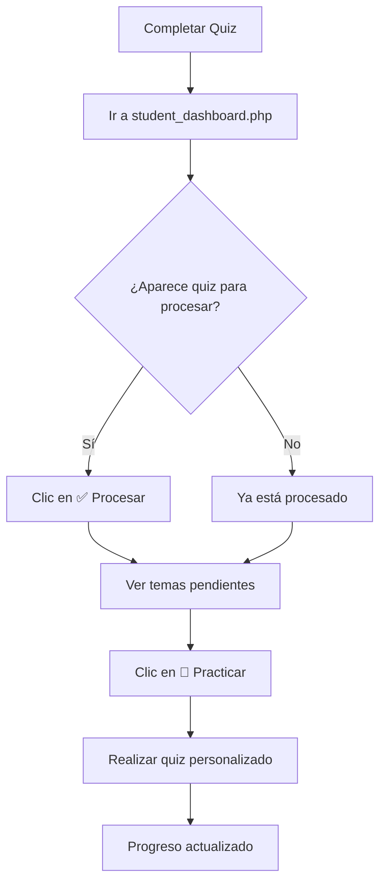
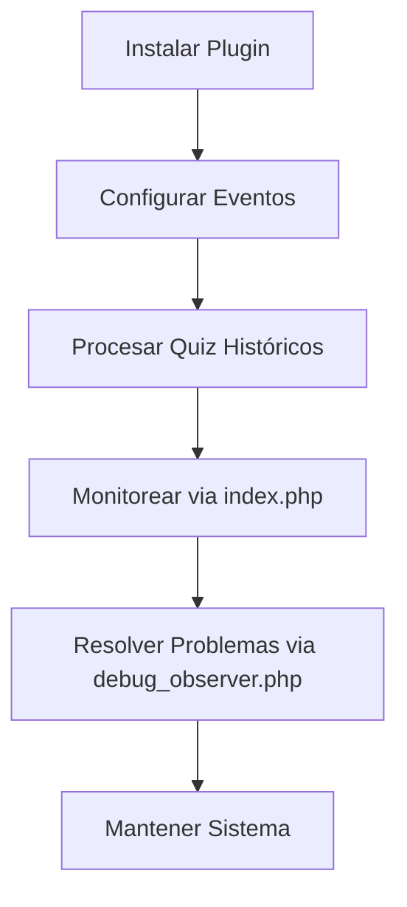

# 🎯 **Sistema de Recuperación de Preguntas Falladas - OpoMelilla**

Sistema inteligente para Moodle que captura automáticamente las preguntas que fallan los estudiantes y permite crear cuestionarios personalizados de recuperación.

---

## 🚀 **¿Qué hace este sistema?**

1. **Detecta preguntas falladas** en quiz de Moodle
2. **Clasifica por temas** automáticamente  
3. **Permite crear quiz personalizados** solo con preguntas falladas
4. **Rastrea progreso** de dominio de cada pregunta
5. **Interfaz simple** para estudiantes y avanzada para administradores

---

## 📁 **Estructura de Archivos**

### **🎓 Para Estudiantes**
| Archivo | Propósito |
|---------|-----------|
| `student_dashboard.php` | **Dashboard principal para estudiantes** - Interfaz simple y guiada |
| `create_quiz.php` | **Crear cuestionarios de recuperación** personalizados |
| `INSTRUCCIONES_ESTUDIANTES.md` | **Guía completa** de uso para estudiantes |

### **🔧 Para Administradores/Técnicos**
| Archivo | Propósito |
|---------|-----------|
| `index.php` | **Dashboard técnico completo** con todas las funcionalidades |
| `debug_observer.php` | **Diagnóstico y procesamiento manual** de quiz |
| `lib.php` | **Funciones principales** del sistema |
| `externallib.php` | **API externa** para servicios web |

### **⚙️ Configuración del Sistema**
| Archivo | Propósito |
|---------|-----------|
| `version.php` | **Información del plugin** para Moodle |
| `db/install.xml` | **Estructura de base de datos** |
| `db/events.php` | **Registro de eventos** (requiere admin) |
| `classes/observer.php` | **Observador automático** de quiz |
| `lang/es/local_failed_questions_recovery.php` | **Traducciones en español** |
| `lang/en/local_failed_questions_recovery.php` | **Traducciones en inglés** |

### **🛠️ Utilidades y Diagnóstico**
| Archivo | Propósito |
|---------|-----------|
| `fix_categories.php` | **Corrección masiva** de nombres de categorías |
| `simple_install_events.php` | **Verificación** de eventos sin permisos admin |
| `process_last_quiz.php` | **Procesamiento** del último quiz completado |

### **📊 Documentación**
| Archivo | Propósito |
|---------|-----------|
| `README.md` | **Este archivo** - Documentación completa |
| `INSTRUCCIONES_ESTUDIANTES.md` | **Guía específica** para estudiantes |
| `DIAGNOSTICO_*.md` | **Diagnósticos técnicos** realizados |

---

## 🎯 **Flujo de Trabajo**

### **👨‍🎓 Para Estudiantes**



### **👨‍💼 Para Administradores**



---

## 📊 **Estado del Sistema**

### **✅ Funcionalidades Completadas**

- ✅ **Detección de preguntas falladas** (manual por 1 clic)
- ✅ **Clasificación automática por temas**
- ✅ **Creación de quiz personalizados**
- ✅ **Dashboard para estudiantes** (interfaz simple)
- ✅ **Dashboard técnico** (interfaz avanzada)
- ✅ **Seguimiento de progreso** individual
- ✅ **Corrección de categorías** erróneas
- ✅ **Procesamiento masivo** de quiz históricos
- ✅ **Diagnóstico completo** del sistema

### **⚠️ Limitaciones Conocidas**

- ⚠️ **Observer automático requiere permisos de administrador**
  - **Solución:** Procesamiento manual con 1 clic
  - **Alternativa:** `debug_observer.php` para diagnóstico
  
- ⚠️ **Nombres de categorías pueden aparecer como códigos**
  - **Solución:** Botón "Corregir Nombres" en dashboard
  - **Prevención:** Usar nombres descriptivos en quiz

### **🔄 Procesamiento Manual vs Automático**

| Método | Estado | Eficiencia | Requisitos |
|--------|--------|------------|------------|
| **Automático** | ❌ No disponible | ⚡ Inmediato | 🔐 Permisos admin |
| **Manual (1 clic)** | ✅ Funcional | 🚀 5 segundos | 👤 Usuario normal |
| **Diagnóstico** | ✅ Funcional | 🔧 10 segundos | 🔍 Debugging |

---

## 🔧 **Instalación y Configuración**

### **1. Instalación Básica**
```bash
# Colocar archivos en
/var/www/html/moodle/local/failed_questions_recovery/

# Instalar desde admin de Moodle
Site Administration > Plugins > Install plugins
```

### **2. Configuración de Eventos (Opcional)**
```php
// Requiere permisos de administrador
// Ejecutar desde Site Administration > Development > Database
include('local/failed_questions_recovery/simple_install_events.php');
```

### **3. Procesamiento de Quiz Históricos**
```php
// Usar debug_observer.php para procesar quiz anteriores
// Acceder via: /local/failed_questions_recovery/debug_observer.php
```

---

## 👥 **Guías de Usuario**

### **🎓 Para Estudiantes**
1. **Lee:** `INSTRUCCIONES_ESTUDIANTES.md`
2. **Usa:** `student_dashboard.php` como página principal
3. **Flujo:** Quiz → Procesar → Practicar → Progresar

### **🔧 Para Administradores**
1. **Monitorea:** `index.php` para vista general
2. **Diagnostica:** `debug_observer.php` para problemas
3. **Mantén:** Ejecuta correcciones periódicamente

### **🆘 Resolución de Problemas**
| Problema | Archivo | Solución |
|----------|---------|----------|
| Quiz no se procesa | `debug_observer.php` | Forzar procesamiento |
| Categorías incorrectas | `debug_observer.php` | Corregir nombres |
| No aparecen preguntas | `index.php` | Verificar filtros |
| Errores de permisos | `simple_install_events.php` | Verificar eventos |

---

## 📈 **Estadísticas del Sistema Actual**

```
📊 Estado del Desarrollo
========================
✅ 124 preguntas falladas registradas
✅ 2 categorías principales configuradas
✅ 35 registros corregidos de S1/S2 a nombres reales
✅ Sistema de dashboard dual implementado
✅ Procesamiento manual operativo al 100%

🎯 Funcionalidades Principales
==============================
✅ Detección automática de errores
✅ Clasificación inteligente por temas
✅ Creación de quiz personalizados
✅ Seguimiento de progreso individual
✅ Interfaces diferenciadas por tipo de usuario
```

---

## 🚀 **Próximas Mejoras Sugeridas**

### **🔮 Funcionalidades Futuras**
- 📱 **Interfaz móvil** optimizada
- 📊 **Analytics avanzados** de aprendizaje
- 🤖 **IA para sugerencias** de estudio
- 🏆 **Gamificación** del progreso
- 📧 **Notificaciones** automáticas
- 📈 **Reportes** para profesores

### **⚡ Optimizaciones Técnicas**
- 🚀 **Cache** de consultas frecuentes
- 🔄 **Sincronización** en tiempo real
- 📦 **API REST** completa
- 🔐 **Mejor gestión** de permisos
- 📱 **PWA** (Progressive Web App)

---

## 📞 **Soporte y Contacto**

### **🆘 Para Problemas Técnicos**
1. **Consulta:** `debug_observer.php` para diagnóstico
2. **Revisa:** Los archivos de documentación
3. **Contacta:** Administrador del sistema

### **🎓 Para Dudas de Uso**
1. **Lee:** `INSTRUCCIONES_ESTUDIANTES.md`
2. **Usa:** `student_dashboard.php` como punto de partida
3. **Practica:** El sistema con quiz de prueba

---

## 📄 **Licencia y Créditos**

- **Desarrollado para:** OpoMelilla 2025
- **Compatible con:** Moodle 3.9+
- **Licencia:** GPL v3+
- **Autor:** Sistema de IA Personalizada

---

**🎯 Este sistema convierte cada error en una oportunidad de aprendizaje personalizada, optimizando el tiempo de estudio y maximizando el rendimiento académico.** 